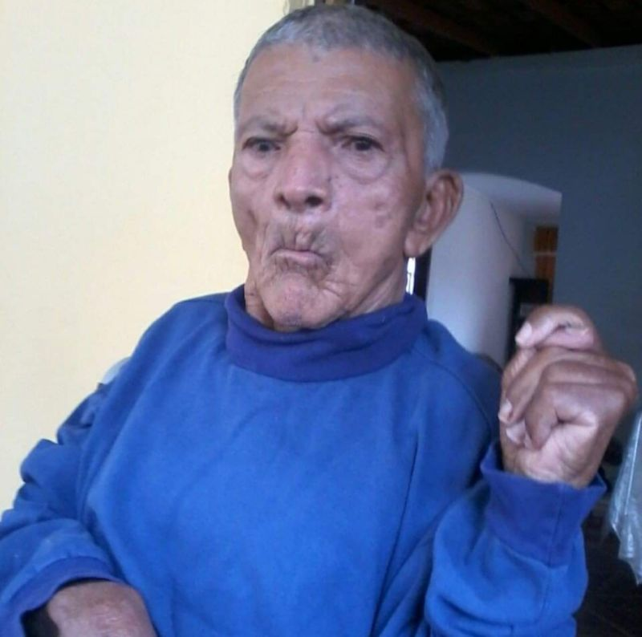
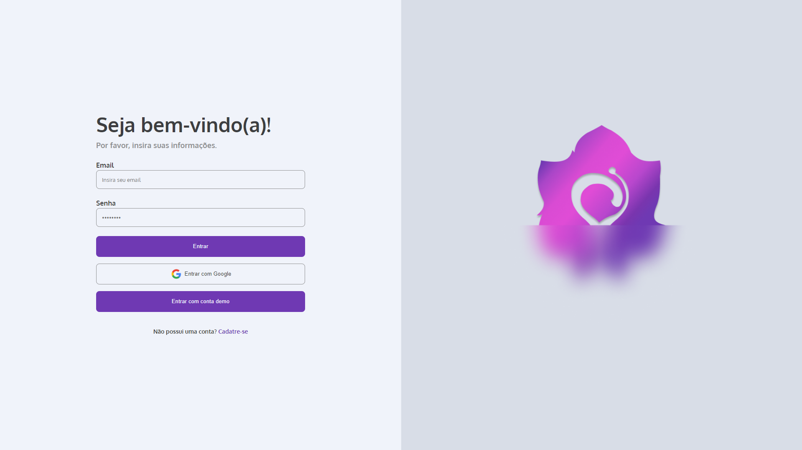
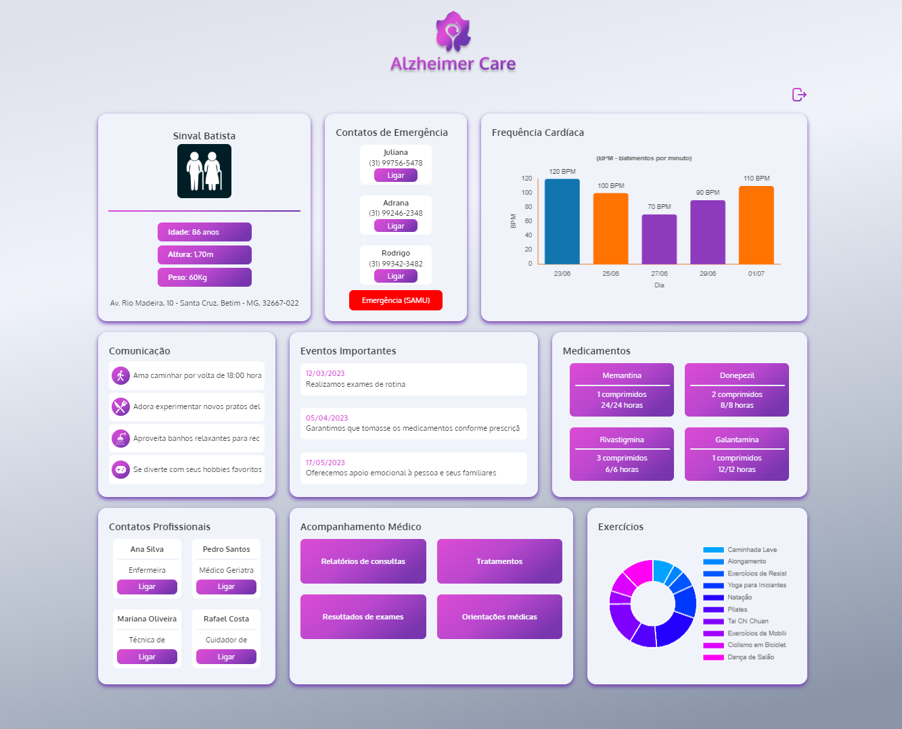

 
 <h2 align="center">Alzheimer Care</h2>
 
Memórias para Sempre: Cuidando com Carinho do Alzheimer

Este é um projeto pessoal, inspirado pelo senhor Sinval Batista.
 

<h1?>PORQUE ESTE PROJETO?</h1>

Este é ele, Sinval Batista. Infelizmente, ele faleceu alguns anos atrás devido ao Mal de Alzheimer. Ainda fica marcado o quão difícil e triste foi essa situação para toda a família.

 O Alzheimer é uma doença lenta e devastadora. Por esse motivo, existem movimentos de prevenção, como o Fevereiro Roxo, que são extremamente necessários para incentivar as pessoas a realizarem consultas médicas visando o diagnóstico precoce da doença, para um tratamento antecipado ou preventivo.

Após vivenciar esse momento doloroso e testemunhar o sofrimento de várias pessoas ao meu redor, decidi iniciar um projeto pessoal chamado Alzheimer Care. Pretendo desenvolver um sistema para armazenar informações sobre a saúde e cuidados de pessoas com Mal de Alzheimer. Essa aplicação será voltada tanto para os pacientes quanto para seus cuidadores ou familiares. Inicialmente, planejo que seja uma aplicação web e, posteriormente, seja desenvolvida também para dispositivos móveis.

Espero que esse projeto possa tornar a vida daqueles que possuem essa doença e das pessoas ao seu redor um pouco mais fácil, gerenciável e menos preocupante. Por isso, decidi compartilhar essa ideia inicial e pretendo também compartilhar o progresso do projeto aqui no LinkedIn, para que pessoas interessadas possam compartilhar suas ideias e opiniões sobre o assunto. Talvez até se torne um projeto de Open Source, algo que tenho em mente.

 

Acompanhe o desenvolvimento e atualizações no <a href="https://www.linkedin.com/in/ikarofelix/recent-activity/all/">Linkedin</a> ou aqui mesmo no <a href="https://github.com/ikarofelix/Alzheimer-Care"> Github.</a>

# Projeto

Página de acesso

Dashboard/Painel do usuário

Esse projeto foi separado em 2 repositórios, sendo <a href="https://github.com/ikarofelix/Alzheimer-Care">Alzheimer-Care</a> o Front-End e <a href="https://github.com/ikarofelix/Alzheimer-Care-Server">Alzheimer-Care-Server</a> o Back-End.

# Tecnologias usadas (Front-End)

> - Vite
> - TypeScript
> - React
> - Redux
> - Styled Components
> - ChartJS
> - Apollo Client
> - Firebase Authentication

# Tecnologias usadas (Back-End)

> - TypeScript
> - NodeJS
> - Cookie Parser
> - JsonWebToken
> - Apollo Server
> - Express
> - GraphQL
> - MySQL
> - Clever Cloud

<h1><a href="https://github.com/users/ikarofelix/projects/3">Atualizações/Progresso do projeto
</a>
</h1>

# LICENSE

MIT License.
